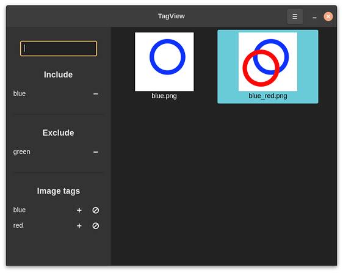

# TagView

### This repository is a work in progress

TagView is a tagging image viewer. It allows searching for images based on tags, adding tags to the query from those of the currently viewed image and excluding images with the specified tags.

While my aim is to build a functional application, this project is first and foremost coding practice for me, and aspects such as looks, hotkeys or optimal UI layout are not a primary concern.

The code is written in C++ using gtkmm.

## Compiling

The project can be compiled with Meson:

    mkdir build
    meson setup build
    cd build
    ninja

## Structure

For a short overview of the project's structure, check the comments in the meson.build file in the src folder.
